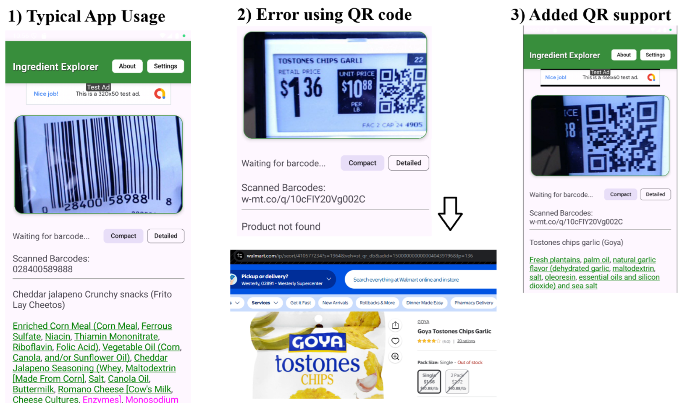
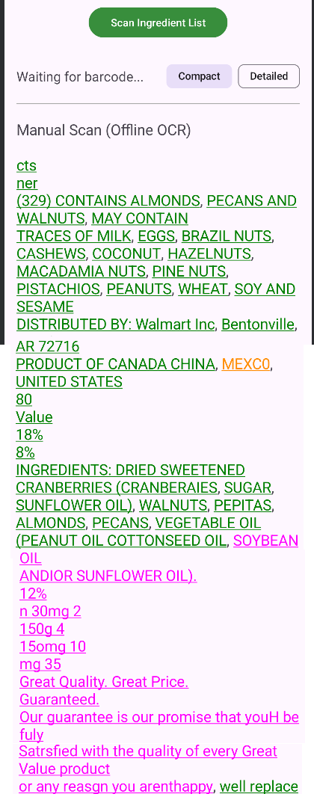
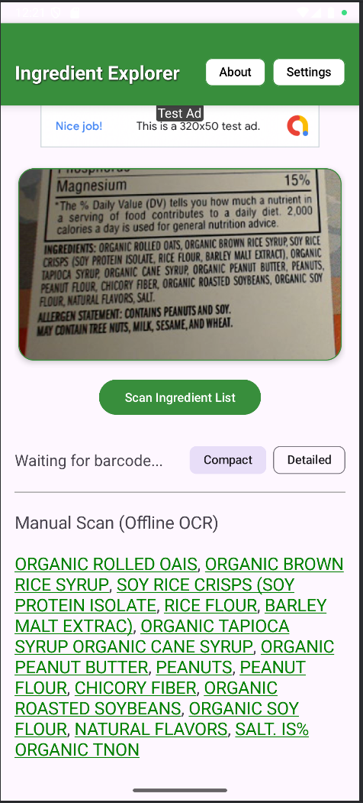
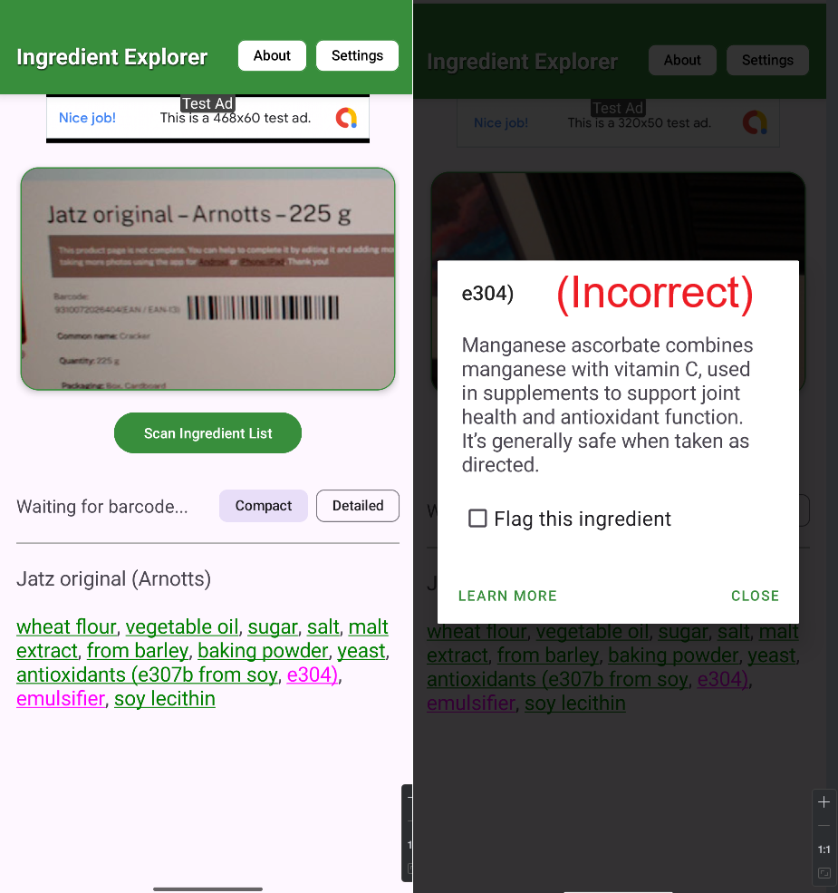
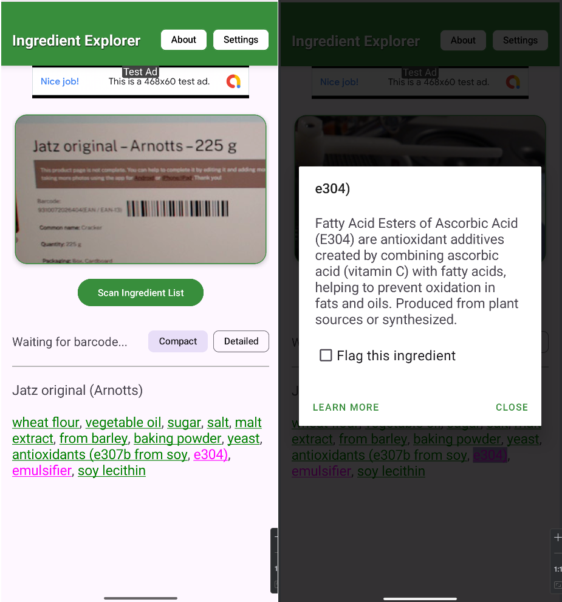

<h1 style="text-align: center; border-bottom: 2px solid #ddd; padding-bottom: 5px;">
Frank Muller – CS ePortfolio
</h1>

Bachelor of Science in Computer Science - Southern New Hampshire University

<h2>Professional Self-Assessment</h2>

Completing coursework throughout my Computer Science program has allowed me to develop and demonstrate the skills needed to be an effective software engineer. During the program I’ve cultivated professional values, learned technical skills, and thoroughly practiced critical thinking and problem solving.

<h3>Collaboration/Teamwork</h3>
<ul>
  <li>Collaboration with SDLC frameworks: Agile, Waterfall, Scrum</li>
  <li>Communication between Designers, Developers, and Stakeholders</li>
  <li>Architectures including Client-Server, Model-View-Controller, RESTful APIs</li>
  <li>Software design documentation, README design, UML diagram design</li>
  <li>UX/UI requirements gathering, interviewing, integrating feedback</li>
</ul>

<h3>Data Structures and Algorithms</h3>
<ul>
  <li>Iterative and Recursive Sorting (Bubble, Insertion, Merge, Quick)</li>
  <li>Binary Search Trees, Hash Maps/Tables, Vectors, Lists, Linked Lists</li>
  <li>Runtime analysis and selecting optimal algorithms for given applications</li>
</ul>

<h3>Software Engineering</h3>
<ul>
  <li>Language experience: C++, Java, JavaScript, Scheme, x86 Assembly, Python</li>
  <li>3D environment design, shaders, objects, and scenes in C++ with OpenGL</li>
  <li>Full stack development on PC as well as mobile Android platforms</li>
  <li>Design philosophies: Test Driven Development, Object-Oriented Programming, Functional Programming</li>
  <li>UX/UI framework design, prototyping, and implementation</li>
</ul>

<h3>Databases and Security</h3>
<ul>
  <li>Created, maintained, and upgraded databases by manipulating JSON/CSV files and using MongoDB, SQL, and NoSQL</li>
  <li>Secure coding practices, encryption, certificates, HTTPS, security testing/auditing</li>
  <li>Software testing and quality assurance, JUnit testing, reverse engineering</li>
</ul>

My three artifacts are all from my Android app <strong>Ingredient Explorer</strong>, which is designed to give a quick summary of a food product’s healthiness and let users learn about unfamiliar ingredients. In the app, users scan food item barcodes and it retrieves a list of the product’s ingredients, color-coded by natural/artificial status. Users can click an ingredient to view a summary of what it is, what it’s for, and any health considerations surrounding it.
These artifacts and the app itself showcase my skills in full stack development, creating a design wireframe and implementing it with databases, algorithms, and UI for a functional application.

<h2>Enhanced Artifacts</h2>

<h3>Software Design & Engineering</h3>
<ul>
  <li><strong>Artifact:</strong> Ingredient Explorer – UI & Architecture</li>
  <li><a href="https://github.com/FrankMullerIV/Portfolio/blob/main/artifact1/Artifact1%20QR%20Codes%20Narrative.pdf">Enhancement Narrative</a></li>
  <li><a href="https://github.com/FrankMullerIV/Portfolio/tree/main/artifact1">View Files</a></li>
  
</ul>

This enhancement expanded my Ingredient Explorer app to support scanning Walmart QR codes in addition to standard UPC barcodes, enabling the app to extract the product’s UPC and return its full ingredient list. It demonstrates my ability to identify real-world usability gaps, research solutions, and implement functional code enhancements to improve user experience.

<table>
  <tr>
    <td style="text-align:center; padding:10px;">
      
<strong>Before (Design Wireframe)</strong>

      
    </td>
  </tr>
  <tr>
    <td style="text-align:center; padding:10px;">
      
<strong>After (App Implementation)</strong>

      
    </td>
  </tr>
    <tr>
    <td style="text-align:center; padding:10px;">
      
<strong>QR Scanning Enhancement</strong>

      
    </td>
  </tr>
</table>

<h3>Algorithms & Data Structures</h3>
<ul>
  <li><strong>Artifact:</strong> Ingredient Explorer – Optical Character Recognition</li>
  <li><a href="https://github.com/FrankMullerIV/Portfolio/blob/main/artifact2/Artifact2%20OCR%20Narrative.pdf">Enhancement Narrative</a></li>
  <li><a href="https://github.com/FrankMullerIV/Portfolio/tree/main/artifact2">View Files</a></li>
  </ul>

This enhancement added OCR functionality to my app, allowing users to capture ingredient lists from product labels with their camera instead of relying only on UPC lookups. It highlights my ability to process unstructured real-world data, clean it algorithmically, and integrate it seamlessly into an existing system.

<table>
  <tr>
    <td style="text-align:center; padding:10px;">
      
<strong>Before</strong>

      
    </td>
    <td style="text-align:center; padding:10px;">
      
<strong>After</strong>

      
    </td>
  </tr>
</table>

<h3>Databases</h3>
<ul>
  <li><strong>Artifact:</strong> Ingredient Explorer – E-Number Database Upgrade</li>
  <li><a href="https://github.com/FrankMullerIV/Portfolio/blob/main/artifact3/Artifact3%20E%20Number%20Narrative.pdf">Enhancement Narrative</a></li>
  <li><a href="https://github.com/FrankMullerIV/Portfolio/tree/main/artifact3">View Files</a></li>
  </ul>

This enhancement expanded the Ingredient Explorer database to support European Ingredient codes aka E-numbers, allowing users to view correct ingredient descriptions for food additives listed by code (e.g., E213 refers to Calcium Benzoate). It demonstrates my ability to maintain and adapt databases with real-world data and ensure compatibility with international ingredient standards.

<table>
  <tr>
    <td style="text-align:center;">
      
<strong>Before</strong>

      
    </td>
    <td style="text-align:center;">
      
<strong>After</strong>

      
    </td>
  </tr>
</table>

<h2>Contact</h2>

<a href="mailto:frank.muller@snhu.edu">frank.muller@snhu.edu</a> 
<a href="https://github.com/FrankMullerIV">GitHub Profile</a>

