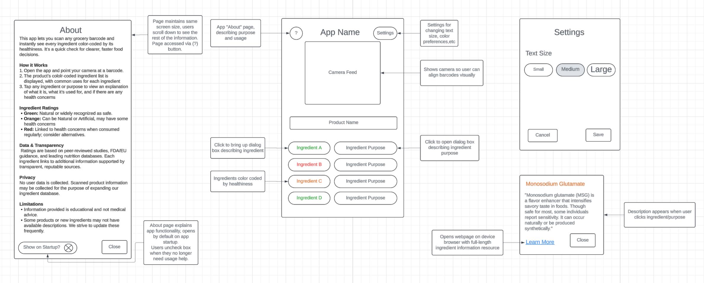
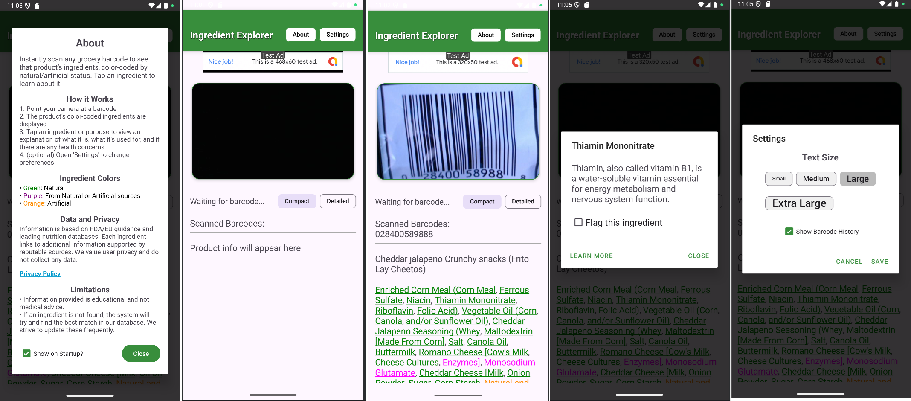

<h1 style="text-align: center; border-bottom: 2px solid #ddd; padding-bottom: 5px;">
Frank Muller – Computer Science ePortfolio
</h1>

Bachelor of Science in Computer Science - Southern New Hampshire University

<h2>Professional Self-Assessment</h2>

Completing coursework throughout my Computer Science program has allowed me to develop and demonstrate the skills needed to be an effective software engineer. During the program I’ve cultivated professional values, learned technical skills, and thoroughly practiced critical thinking and problem solving.

<h3>Collaboration/Teamwork</h3>
<ul>
  <li>Collaboration with SDLC frameworks: Agile, Waterfall, Scrum</li>
  <li>Communication between Designers, Developers, and Stakeholders</li>
  <li>Architectures including Client-Server, Model-View-Controller, RESTful APIs</li>
  <li>Software design documentation, README design, UML diagram design</li>
  <li>UX/UI requirements gathering, interviewing, integrating feedback</li>
</ul>

<h3>Data Structures and Algorithms</h3>
<ul>
  <li>Iterative and Recursive Sorting (Bubble, Insertion, Merge, Quick)</li>
  <li>Binary Search Trees, Hash Maps/Tables, Vectors, Lists, Linked Lists</li>
  <li>Runtime analysis and selecting optimal algorithms for given applications</li>
</ul>

<h3>Software Engineering</h3>
<ul>
  <li>Language experience: C++, Java, JavaScript, Scheme, x86 Assembly, Python</li>
  <li>3D environment design, shaders, objects, and scenes in C++ with OpenGL</li>
  <li>Full stack development on PC as well as mobile Android platforms</li>
  <li>Design philosophies: Test Driven Development, Object-Oriented Programming, Functional Programming</li>
  <li>UX/UI framework design, prototyping, and implementation</li>
</ul>

<h3>Databases and Security</h3>
<ul>
  <li>Created, maintained, and upgraded databases by manipulating JSON/CSV files and using MongoDB, SQL, and NoSQL</li>
  <li>Secure coding practices, encryption, certificates, HTTPS, security testing/auditing</li>
  <li>Software testing and quality assurance, JUnit testing, reverse engineering</li>
</ul>

My three artifacts are all from my Android app <strong>Ingredient Explorer</strong>, which is designed to give a quick summary of a food product’s healthiness and let users learn about unfamiliar ingredients. In the app, users scan food item barcodes and it retrieves a list of the product’s ingredients, color-coded by natural/artificial status. Users can click an ingredient to view a summary of what it is, what it’s for, and any health considerations surrounding it.

These artifacts and the app itself showcase my skills in full stack development, creating a design wireframe and implementing it with databases, algorithms, and UI for a functional application.

<h2>Enhanced Artifacts</h2>
<!-- Keep your artifact sections here as you had them -->

<h3>Enhancement 1 – Software Design & Engineering</h3>
<ul>
  <li><strong>Artifact:</strong> Ingredient Explorer – UI & Architecture</li>
  <li><strong>Enhanced:</strong> <a href="artifact1">View Enhanced Code</a></li>
</ul>

  
<strong>Before</strong>

  

  
<strong>After</strong>

  

This artifact originally implemented basic UI features. In the enhanced version, I refactored the architecture to use MVC, improved usability, and added database integration.  

<h3>Enhancement 2 – Algorithms & Data Structures</h3>
<ul>
  <li><strong>Artifact:</strong> <em>Project Name</em></li>
  <li><strong>Original:</strong> <a href="artifact2">Link to original code</a></li>
  <li><strong>Enhanced:</strong> <a href="artifact2">Link to enhanced code</a></li>
</ul>

Brief description of algorithmic improvements, efficiency gains, and skills demonstrated.

<h3>Enhancement 3 – Databases</h3>
<ul>
  <li><strong>Artifact:</strong> <em>Project Name</em></li>
  <li><strong>Original:</strong> <a href="artifact3">Link to original code</a></li>
  <li><strong>Enhanced:</strong> <a href="artifact3">Link to enhanced code</a></li>
</ul>

Brief description of database enhancements, technologies used, and skills demonstrated.

<h2>Course Outcomes Alignment</h2>
<ol>
  <li>Collaborative environments</li>
  <li>Professional communication</li>
  <li>Design and evaluate computing solutions</li>
  <li>Apply innovative computing techniques</li>
  <li>Develop a security mindset</li>
</ol>

<h2>Additional Work (Optional)</h2>

Links to extra projects, certifications, or other relevant professional work.

<h2>Contact</h2>

<a href="mailto:frank.muller@snhu.edu">frank.muller@snhu.edu</a> 
<a href="#">GitHub Profile</a>

